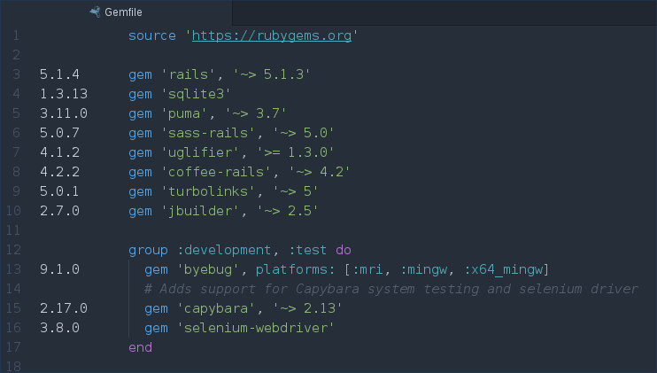

# gemfile-gutter

An [Atom](https://atom.io/) package which adds a gutter to your [Gemfile](https://bundler.io/gemfile.html) and Gemfile.lock, showing each gem's installed version.
Clicking the gutter opens the gem on [RubyGems.org](https://rubygems.org/).



## Installation

```
apm install gemfile-gutter
```

## Usage

By default, gemfile-gutter will be shown automatically when you open a Gemfile.
You can change this behavior in the settings or toggle the gutter with its keybinding <kbd>Ctrl</kbd><kbd>Alt</kbd><kbd>G</kbd>.


## How it works

gemfile-gutter parses the Gemfile.lock to find the installed versions.
